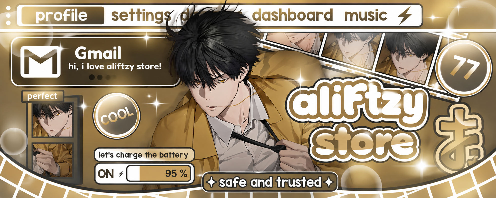
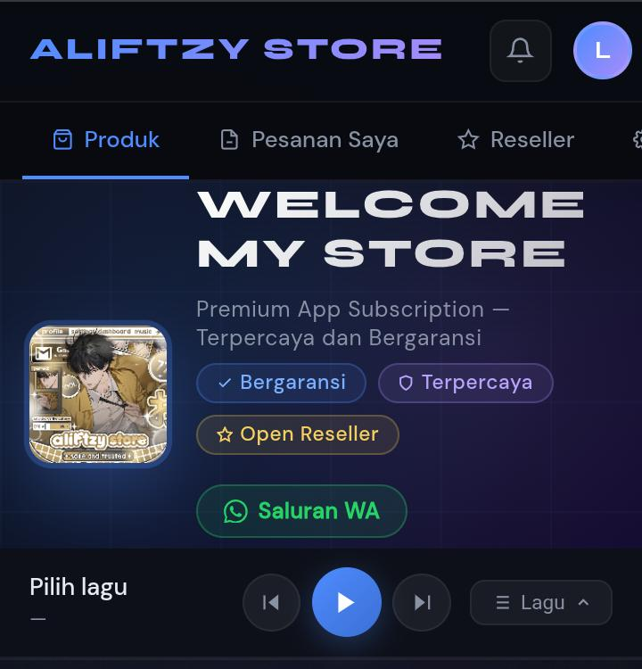
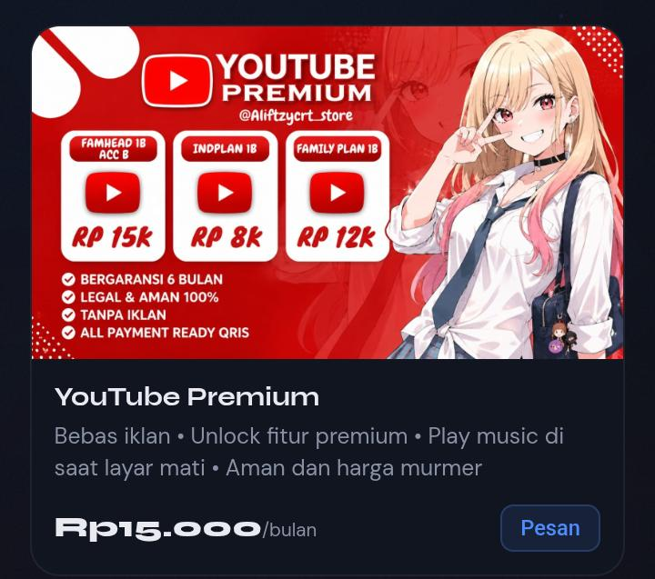
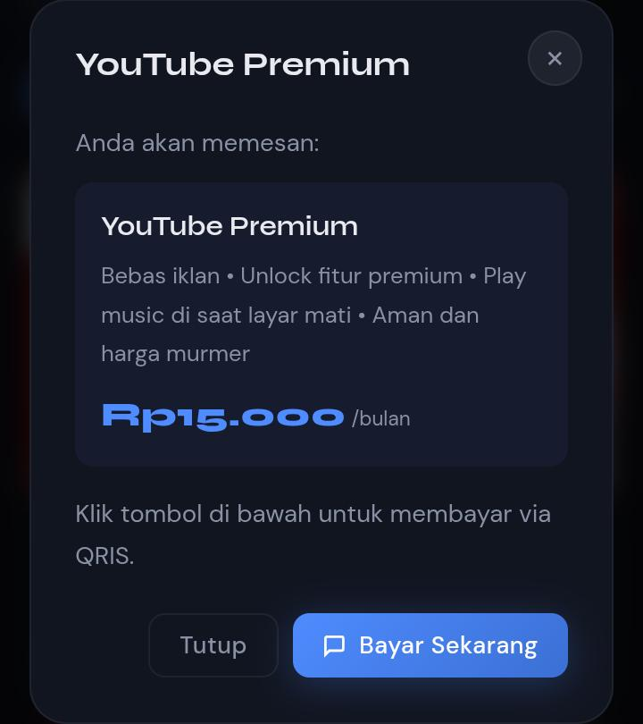
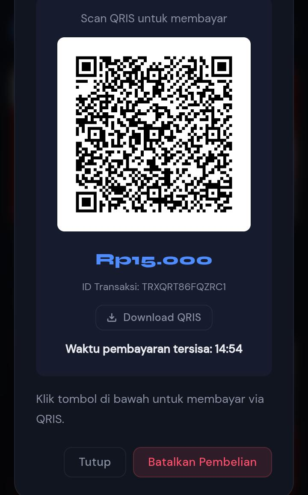
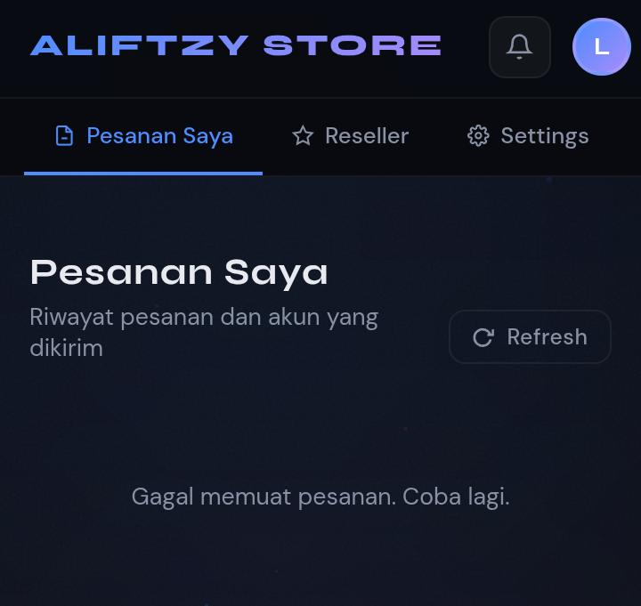
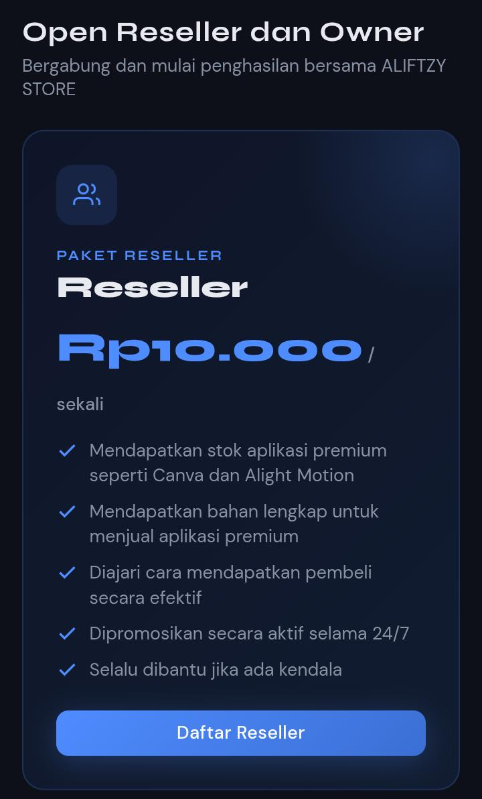
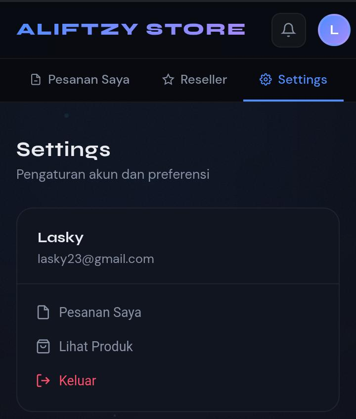

<p align="center">
  
</p>

<h1 align="center">🛍️ Aliftzy Store</h1>

<p align="center">
<b>Modern Digital Store • Safe & Trusted</b>
</p>

<p align="center">


</p>

---

# 📸 Website Preview

## 🏠 Home

<p align="center">

</p>

---

## 🛒 Products

<p align="center">

</p>

---

## 💰 Product Detail

<p align="center">

</p>

---

## 💳 QRIS Payment

<p align="center">

</p>

---

## 📦 My Orders

<p align="center">

</p>

---

## 🤝 Reseller

<p align="center">

</p>

---

## ⚙️ Settings

<p align="center">

</p>

---

# 🛍️ About

**Aliftzy Store** merupakan website digital store modern yang dikembangkan menggunakan **HTML5, CSS3, JavaScript (ES Modules), Firebase Authentication, Cloud Firestore**, serta backend pembayaran terpisah.

Repository ini berisi **Website Store (Frontend User)** yang digunakan pelanggan untuk melakukan login, melihat produk, melakukan pembelian, dan memantau status pesanan secara realtime.

Dashboard Admin dikembangkan pada repository terpisah agar keamanan, struktur proyek, dan proses maintenance menjadi lebih baik.

---

# ✨ Features

## 👤 Authentication

- Login
- Register
- Logout
- Session Login
- Firebase Authentication

## 🛒 Store

- Product Catalog
- Product Detail
- Categories
- Dynamic Pricing
- Stock Badge
- Responsive Layout

## 💳 Checkout

- Create Order
- Backend Payment Integration
- QRIS Payment
- Realtime Payment Status
- Order History

## 📦 Orders

- My Orders
- Order Detail
- Order Status
- Account Delivery After Admin Process

## 📢 Announcement

- Realtime Announcement
- Firestore Sync

## 🎵 Music

- Playlist
- Music Player

## ⚙️ Settings

- Store Configuration
- Dynamic Information

---

# 🛠️ Technologies

- HTML5
- CSS3
- JavaScript (ES Modules)
- Firebase Authentication
- Cloud Firestore
- Firebase SDK
- Railway
- SiTransfer
- GitHub
- Netlify
- Vercel

---

# 📁 Project Structure

```text
Aliftzy-Store/
│
├── api/
├── assets/
├── css/
├── js/
├── lib/
├── index.html
└── package.json
```

---

# 🔥 Database

Menggunakan satu Firebase Project yang sama dengan Dashboard Admin.

Collection yang digunakan:

```text
products
songs
settings
announcements
stock
orders
```

Seluruh perubahan yang dilakukan Dashboard Admin akan langsung tersinkronisasi secara realtime ke Website Store melalui Cloud Firestore.

---

# 🔒 Security

- Firebase Authentication
- Firestore Security Rules
- Ownership Validation
- Store & Admin Repository Separation
- Realtime Firestore Synchronization

---

# 🚀 Deployment

Website dapat di-deploy menggunakan:

- Netlify
- Vercel
- Firebase Hosting

Pastikan menggunakan Firebase Project yang sama dengan Dashboard Admin.

---

# 👨‍💻 Developer

## Muhammad Alifudin

**Mahasiswa SMK Industri Kreatif Kota Bekasi**

🌐 **Official Developer Website**  
https://privatealif.netlify.app

---

# 📅 Timeline

| Tahap | Tanggal |
|-------|----------|
| 🚀 Project Dimulai | **12 Juni 2026** |
| 🎉 Project Selesai | **4 Juli 2026** |

Durasi pengembangan sekitar **22 hari**.

---

# 🙏 Special Thanks

### 🤖 Artificial Intelligence
- ChatGPT (OpenAI)
- Claude AI (Anthropic)

### ☁️ Backend
- Firebase Authentication
- Cloud Firestore
- Firebase SDK

### 🚀 Hosting & Deployment
- GitHub
- Netlify
- Railway
- Vercel

### 💳 Payment
- SiTransfer
- QRIS

### 💻 Development
- Visual Studio Code
- Git
- GitHub Desktop
- Node.js
- npm

### 🌐 Web Technologies
- HTML5
- CSS3
- JavaScript (ES Modules)

---

# 📌 Notes

Repository ini hanya berisi **Website Store**.

Dashboard Admin dikembangkan pada repository terpisah namun tetap menggunakan Firebase Authentication dan Cloud Firestore yang sama sehingga seluruh perubahan dari Admin akan langsung muncul di Website Store secara realtime.

---

# 📄 License

**© 2026 Muhammad Alifudin**

Seluruh source code dan desain dibuat untuk kebutuhan **Aliftzy Store**.

Dilarang memperbanyak, memodifikasi, mendistribusikan, atau menggunakan sebagian maupun seluruh isi project ini tanpa izin dari pemilik.

---

<p align="center">
<b>🛍️ Aliftzy Store v1.0</b><br>
Developed with ❤️ by <b>Muhammad Alifudin</b><br>
🌐 https://privatealif.netlify.app
</p>
